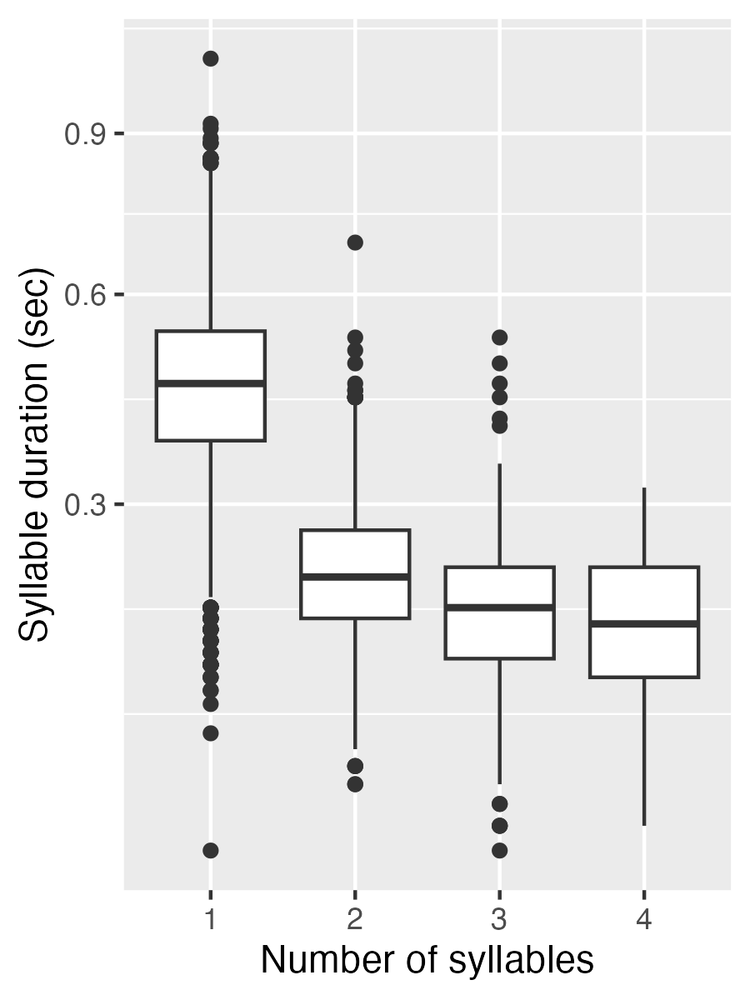

.. _case_study_duration:

****************************
Case study 1: Polysyllabic shortening
****************************

Motivation
----------

Polysyllabic shortening refers to the "same" rhythmic unit (syllable or vowel) becoming shorter as the size of the containing domain (word or prosodic domain) increases. Two classic examples:

* English: stick, sticky, stickiness :cite:p:`lehiste1972timing`
* French: pâte, pâté, pâtisserie :cite:p:`grammont1914traite`

Polysyllabic shortening is often – but not always – defined as being restricted to accented syllables. (As in the English, but not the French example.) Using PolyglotDB, we can check whether a simple version of polysyllabic shortening holds in the tutorial corpus, namely:

* Considering all utterance-final words, does the initial vowel duration decrease as word length increases?

This case study is essentially the same as Tutorials 1-3 together, run on a larger corpus, and visualizing the results.

Step 0: Preliminaries
---------------------

Before importing the corpus data, the following Python libraries are loaded, including PolyglotDB.

.. code-block:: python

	import os # for parsing the paths to the corpus enrichment files

	# PolyglotDB imports
	from polyglotdb import CorpusContext
	import polyglotdb.io as pgio

The data used here is the full Librispeech-aligned corpus (available :ref:`here<tutorial_download>`).

.. code-block:: python

	## name and path to the corpus
	corpus_root = '.data/LibriSpeech-aligned'
	corpus_name = 'Librispeech-aligned'

	## names of the enrichment files
	speaker_filename = "SPEAKERS.csv"
	stress_data_filename = "iscan_lexicon.csv"

	## get the paths to the corpus enrichment files
	speaker_enrichment_path = os.path.join(corpus_root, 'enrichment_data', speaker_filename)
	lexicon_enrichment_path = os.path.join(corpus_root, 'enrichment_data', stress_data_filename)

Step 1: Import
--------------

With the corpus information defined, the corpus can now be imported into a PolyglotDB database.

.. code-block:: python

	## use the MFA parser
	parser = pgio.inspect_mfa(corpus_root)
	parser.call_back = print

	with CorpusContext(corpus_name) as c:
		print("Loading data...")
		c.load(parser, corpus_root)

Step 2: Enrichment
------------------

Now that the corpus has been imported as a database, it is now necessary to enrich the database with information about linguistic objects, such as word frequency, speech rate, vowel duration, and so on. Here, we will walk through each enrichment that is necessary for examining vowel duration to address our question ("Considering all utterance final...").

**Syllables**

Syllables are encoded in two steps. First, the set of syllabic segments in the phonological inventory have to be specified. Here, the set of phonemes can be provided as a list. This list is then used to encode a `subset` of phonemes corresonding to a class (i.e., syllabic segments). This class is used to encode the syllabic information into the database.

.. code-block:: python

	## set of syllabic segments
	syllabics = ["ER0", "IH2", "EH1", "AE0", "UH1", "AY2", "AW2", "UW1", "OY2", "OY1", "AO0", "AH2", "ER1", "AW1", "OW0", "IY1", "IY2", "UW0", "AA1", "EY0", "AE1", "AA0", "OW1", "AW0", "AO1", "AO2", "IH0", "ER2", "UW2", "IY0", "AE2", "AH0", "AH1", "UH2", "EH2", "UH0", "EY1", "AY0", "AY1", "EH0", "EY2", "AA2", "OW2", "IH1"]

	## use syllabic labels to encode syllables
	with CorpusContext(corpus_name) as c:
		print("Encoding syllables...")
		c.encode_type_subset('phone', syllabics, 'syllabic')
		c.encode_syllables(syllabic_label='syllabic')

**Utterances**

For our purposes, we define an utterance as a stretch of speech separated by pauses. So now we will specify a minimum duration of pause that separates utterances (150ms is typically a good default), as well as by segmental instances that reflect pauses (e.g., that come from an aligner). As with the syllabics, a label used to represent pauses can be passed to polyglot for the purposes of encoding pauses.

.. code-block:: python

	## pause label
	pause_labels = ['<SIL>']

	## encode utterances from both
	## pause labels and 150ms stretches
	with CorpusContext(corpus_name) as c:
		print("Encoding utterances...")
		c.encode_pauses(pause_labels)
		c.encode_utterances(min_pause_length=0.15)

**Speakers**

To enrich the database with speaker information, we use the enrichment CSV (which contains the speaker metadata).

.. code-block:: python

	with CorpusContext(corpus_name) as c:
		print("Encoding speakers...")
		c.enrich_speakers_from_csv(speaker_enrichment_path)

**Lexicon**

As with the speaker information, lexical information can be uploaded in an analogous way. For the purposes of this case study, the lexicon contains information about the stress pattern of words.

.. code-block:: python

	with CorpusContext(corpus_name) as c:
		print("Encoding lexicon...")
		c.enrich_lexicon_from_csv(lexicon_enrichment_path)
		c.encode_stress_from_word_property('stress_pattern')

**Speech rate**

As the database is enriched with both syllabic and utterance information, it is possible to enrich the database with a measure of speech rate, such as syllables-per-second.

.. code-block:: python

	with CorpusContext(corpus_name) as c:
		print("Encoding rate...")
		c.encode_rate('utterance', 'syllable', 'speech_rate')

Step 3: Query
-------------

Now that the database has been enriched with all of the properties necessary for analysis, it is now necessary to construct a query. Queries enable us to search the database for particular set of linguistic objects of interest.

Queries can be typically thought of as having two distinct sections: the *filtering* of the database for the particular objects of interest (e.g., stressed word-initial syllables, word-final nasals, etc), and the definition of *columns* to be exported (e.g., the start and end times of segments, speech rate, speaker names, etc).

The query is first constructed by calling the ``query_graph()`` function, which defines what linguistic level should be queried (e.g., syllables, phonemes, utterances, etc). This can then be filtered. This case study is interested in stressed word-initial, utterance-final syllables. Columns for the syllable and word information are extracted, along with the speaker name and speech rate, as well as the name of the audio file (`discourse`). Finally, the query is written to CSV format

.. code-block:: python

	export_path = "./polysyllabic.csv"

	with CorpusContext(corpus_name) as c:
		print("Generating query...")
		## utterance-final word-initial stressed syllables
		q = c.query_graph(c.syllable)
		q = q.filter(c.syllable.stress == '1')
		q = q.filter(c.syllable.begin == c.syllable.word.begin)
		q = q.filter(c.syllable.word.end == c.syllable.word.utterance.end)

		## syllable information
		q = q.columns(c.syllable.label.column_name('syllable'),
		c.syllable.duration.column_name('syllable_duration'),

		## word information
		c.syllable.word.label.column_name('word'),
		c.syllable.word.begin.column_name('word_begin'),
		c.syllable.word.end.column_name('word_end'),
		c.syllable.word.num_syllables.column_name('word_num_syllables'),
		c.syllable.word.stress_pattern.column_name('word_stress_pattern'),

		## speech rate & speaker information
		c.syllable.word.utterance.speech_rate.column_name('utterance_speech_rate'),
		c.syllable.speaker.name.column_name('speaker'),
		c.syllable.discourse.name.column_name('file'))

	print("Writing query to file...")
	q.to_csv(export_path)

Step 4: Analysis
----------------

With the syllable duration data extracted, the data can be analysed with respect to the research question. First the data is loaded into `R`.

.. code-block:: r

	library(tidyverse)
	df <- read.csv("polysyllabic.csv")

Next data quantity is checked, particularly the number of word types and tokens for each number of syllables.

.. code-block:: r

	df %>% group_by(word_num_syllables) %>% summarise(types = n_distinct(word), tokens = n())
	# A tibble: 5 × 3
	#  word_num_syllables types tokens
	#              <int> <int>  <int>
	#                  1   999   2892
	#                  2   815   1376
	#                  3   263    355
	#                  4    38     40
	#                  5     2      2

We see that there are only 2 tokens (and 2 unique types) for 5-syllable words, these are excluded from further analysis.

.. code-block:: r

	df <- filter(df, word_num_syllables <= 4)

The plot of syllable duration as a function of the number of syllables demonstrate that there is a large reduction in syllable duration between 1-syllable and 2-syllable words. 3+ syllable words are also generally shorter, though this difference is much less pronounced.

.. code-block:: r

	df %>% ggplot(aes(x = factor(word_num_syllables), y = syllable_duration)) +
		geom_boxplot() +
		scale_y_sqrt() +
		xlab("Number of syllables") +
		ylab("Syllable duration (sec)")

