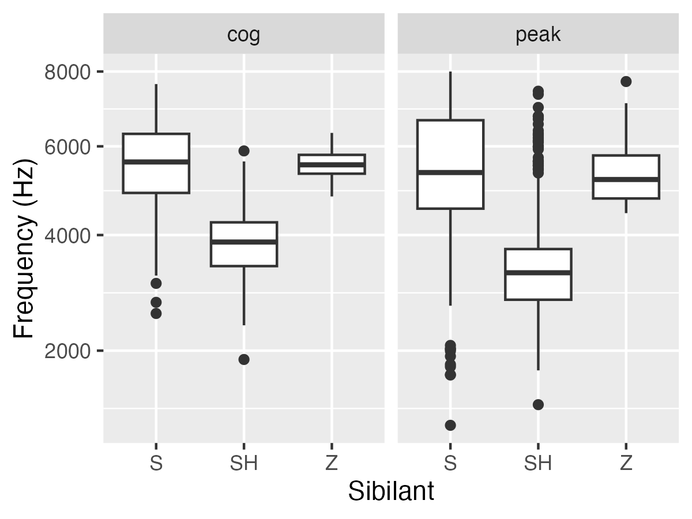

.. _case_study_praat:

*********************************************************
Case study 4: Sibilant analysis using custom Praat script
*********************************************************

Motivation
----------

This case study demonstrates **applying a Praat script to make custom measures**.  These are "static measures", e.g. one COG value per sibilant token or one F1 and F2 value per vowel token.

Sibilants, and in particular, /s/, have been observed to show interesting sociolinguistic variation according to a range of intersecting factors, including gendered, class, and ethnic identities (Stuart-Smith, 2007; Levon, Maegaard and Pharao, 2017). Sibilants - /s ʃ z ʒ/ - also show systematic variation according to place of articulation (Johnson, 2003). Alveolar fricatives /s z/ as in send, zen, are formed as a jet of air is forced through a narrow constriction between the tongue tip/blade held close to the alveolar ridge, and the air strikes the upper teeth as it escapes, resulting in high pitched friction. The post-alveolar fricatives /ʃ ʒ/, as in ‘sheet’, ‘Asia’, have a more retracted constriction, the cavity in front of the constriction is a bit longer/bigger, and the pitch is correspondingly lower. In many varieties of English, the post-alveolar fricatives also have some lip-rounding, reducing the pitch further.

Acoustically, sibilants show a spectral ‘mountain’ profile, with peaks and troughs reflecting the resonances of the cavities formed by the articulators (Jesus and Shadle, 2002). The frequency of the main spectral peak, and/or main area of acoustic energy (Centre of Gravity), corresponds quite well to shifts in place of articulation, including quite fine-grained differences, such as those which are interesting for sociolinguistic analysis: alveolars show higher frequencies, more retracted post-alveolars show lower frequencies.

* How do English /ʃ/ and /ʒ/ differ in their spectral peaks and centre of gravity?

Step 1: Import
--------------

As with previous case studies, the Python libraries are loaded, and the aligned Librispeech corpus is imported.

.. code-block:: python

	import os # for parsing the paths to the corpus enrichment files

	# PolyglotDB imports
	from polyglotdb import CorpusContext
	import polyglotdb.io as pgio

	## name and path to the corpus
	corpus_root = '.data/LibriSpeech-aligned'
	corpus_name = 'Librispeech-aligned'

	## names of the enrichment files
	speaker_filename = "SPEAKERS.csv"
	stress_data_filename = "iscan_lexicon.csv"

	## get the paths to the corpus enrichment files
	speaker_enrichment_path = os.path.join(corpus_root, 'enrichment_data', speaker_filename)
	lexicon_enrichment_path = os.path.join(corpus_root, 'enrichment_data', stress_data_filename)

	## use the MFA parser
	parser = pgio.inspect_mfa(corpus_root)
	parser.call_back = print

	with CorpusContext(corpus_name) as c:
		print("Loading data...")
		c.load(parser, corpus_root)

Step 2: Basic enrichment
------------------------

Also as with previous case studies, utterance, syllabic, and speaker information is encoded.

.. code-block:: python

	## set of syllabic segments
	syllabics = ["ER0", "IH2", "EH1", "AE0", "UH1", "AY2", "AW2", "UW1", "OY2",
	"OY1", "AO0", "AH2", "ER1", "AW1", "OW0", "IY1", "IY2", "UW0", "AA1", "EY0",
	"AE1", "AA0", "OW1", "AW0", "AO1", "AO2", "IH0", "ER2", "UW2", "IY0", "AE2",
	"AH0", "AH1", "UH2", "EH2", "UH0", "EY1", "AY0", "AY1", "EH0", "EY2", "AA2",
	"OW2", "IH1"]

	## use syllabic labels to encode syllables
	with CorpusContext(corpus_name) as c:
		print("Encoding syllables...")
		c.encode_type_subset('phone', syllabics, 'syllabic')
		c.encode_syllables(syllabic_label='syllabic')

	## pause label
	pause_labels = ['<SIL>']

	## encode utterances from both
	## pause labels and 150ms stretches
	with CorpusContext(corpus_name) as c:
		print("Encoding utterances...")
		c.encode_pauses(pause_labels)
		c.encode_utterances(min_pause_length=0.15)

	with CorpusContext(corpus_name) as c:
		print("Encoding speakers...")
		c.enrich_speakers_from_csv(speaker_enrichment_path)

	with CorpusContext(corpus_name) as c:
		print("Encoding lexicon...")
		c.enrich_lexicon_from_csv(lexicon_enrichment_path)
		c.encode_stress_from_word_property('stress_pattern')

Step 3: Sibilant acoustic enrichment
------------------------------------

PolyglotDB supports the enrichment of custom information from Praat scripts. Here, a custom Praat script has been written to extract spectral information -- spectral Centre of Gravity (COG) and spectral peak -- for a given segment. PolyglotDB will apply this script to the subset of segments, and enrich the database with these measures. `Praat script <https://github.com/MontrealCorpusTools/PolyglotDB/blob/main/examples/case_studies/praat_sibilants/polyglotdb_sibilant.praat>`_

First a subset of segments are defined -- `sibilants` -- which are going to be analysed for spectral information.

.. code-block:: python

	sibilant_segments = ["S", "Z", "SH", "ZH"]

Polyglot is provided both the path to the Praat executable and the specific sibilant enrichment script.

.. code-block:: python

	praat_path = "/usr/bin/praat" # default path on Unix machine
	sibilant_script_path = "./polyglotdb_sibilant.praat"

The script is then called via the `analyze_script` function.

.. code-block:: python

	with CorpusContext(corpus_name) as c:
		c.encode_class(sibilant_segments, 'sibilant')
		c.analyze_script(annotation_type='phone', subset='sibilant', script_path=sibilant_script_path, duration_threshold=0.01)

Step 4: Query
-------------

Now with sibilant spectral information enriched in the database, a query can be generated to extract the sibilant tokens of interest. Here, the focus is on syllable-onset sibilant segments. Columns for the segmental, syllabic, and word-level information are extracted, as well as the spectral measurements made from the Praat script (`cog`, `peak`).

.. code-block:: python

	output_path = "./sibilant_spectral_output.csv"

	with CorpusContext(corpus_name) as c:
		print("Generating query...")
		## use the sibilant subset to filter segments
		q = c.query_graph(c.phone).filter(c.phone.subset == "sibilant")
		## syllable-initial (onset) only
		q = q.filter(c.phone.begin == c.phone.syllable.word.begin)

		q = q.columns(
		## segmental information
		c.phone.id.column_name("phone_id"),
		c.phone.label.column_name('phone_label'),
		c.phone.duration.column_name('phone_duration'),
		c.phone.begin.column_name("phone_begin"),
		c.phone.end.column_name("phone_end"),

		## surrounding segmental labels
		c.phone.following.label.column_name("following_phone_label"),
		c.phone.previous.label.column_name("previous_phone_label"),

		## syllabic information
		c.phone.syllable.label.column_name("syllable_label"),
		c.phone.syllable.stress.column_name("syllable_stress"),
		c.phone.syllable.duration.column_name("syllable_duration"),

		## labels for each part of the syllable
		c.phone.syllable.phone.filter_by_subset('onset').label.column_name('onset'),
		c.phone.syllable.phone.filter_by_subset('nucleus').label.column_name('nucleus'),
		c.phone.syllable.phone.filter_by_subset('coda').label.column_name('coda'),

		## word, speaker, and utterance-level information
		c.phone.syllable.word.label.column_name('word_label'),
		c.phone.syllable.word.begin.column_name('word_begin'),
		c.phone.syllable.word.end.column_name('word_end'),
		c.phone.syllable.word.utterance.speech_rate.column_name('utterance_speech_rate'),
		c.phone.syllable.speaker.name.column_name('speaker'),
		c.phone.syllable.discourse.name.column_name('file'),

		## spectral measures enriched from Praat script
		c.phone.cog.column_name('cog'),
		c.phone.peak.column_name('peak')
		)

		print("Writing query to file...")
		q.to_csv(export_path)

Step 5: Analysis
----------------

As before, the exported CSV file can then be loaded into R.

.. code-block:: r

	library(tidyverse)

	df <- read.csv("sibilant_spectral_output.csv")

	## check the number of tokens for each segment
	df %>%
	group_by(phone_label) %>%
	tally()
	# A tibble: 3 × 2
	# phone_label       n
	# <chr>         <int>
	# 1 S            3298
	# 2 SH            641
	# 3 Z              12

Both spectral centre of gravity and spectral peak are plotted below, showing that /ʃ/ generally exhibit both lower peaks and centre of gravity, compared with both /s/ and /z/.

.. code-block:: r

	df %>%
		## make a single column for spectral measures
		## so both measures can be plotted side-by-side
		pivot_longer(c(peak, cog), names_to = "measure", values_to = "value") %>%
		ggplot(aes(x = phone_label, y = value)) + geom_boxplot() +
			facet_wrap(~measure) +
			scale_y_sqrt() +
			ylab("Frequency (Hz)") +
			xlab("Sibilant")

