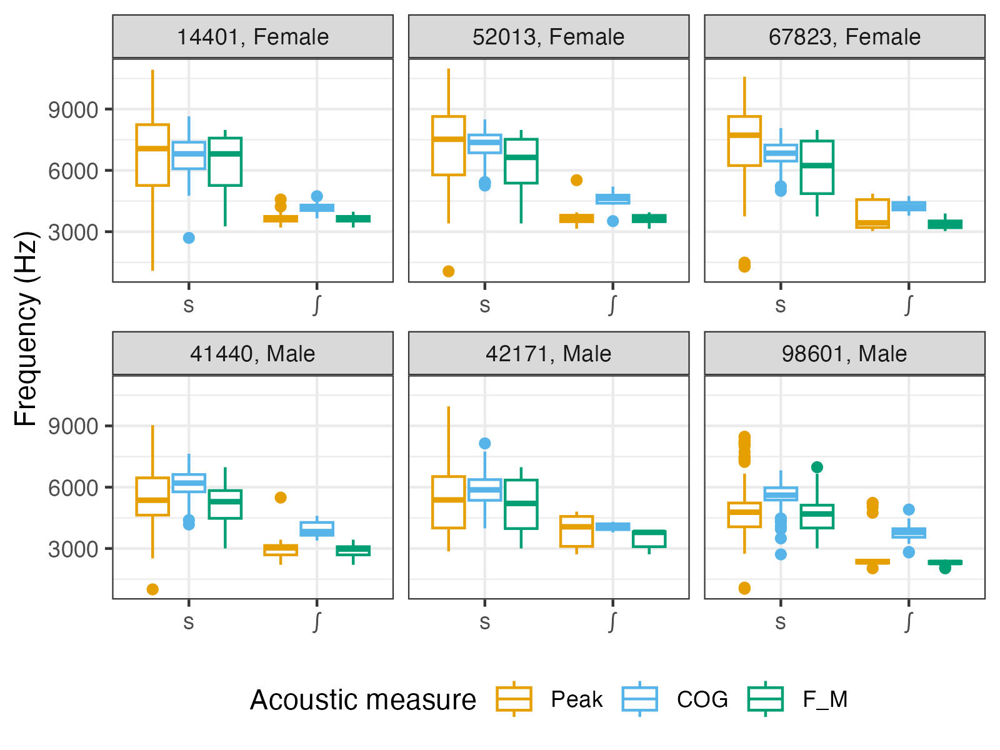

.. _case_study_sibilants:

********************************
Case study 3: Sibilant acoustics
********************************

**Author**: `Massimo Lipari <https://massimolipari.github.io/>`_

Motivation
==========

Various acoustic measures have been used over the years in the literature on sibilant fricatives (henceforth, just *sibilants*). Measures of the overall spectral peak and of the spectral center of gravity (the weighted mean frequency of the spectrum)--referred to as *peak* and *COG* below--both have long histories. More recently, it has become common to instead look for a 'main' peak (meant to correspond to the lowest resonance of the cavity anterior to the principal constriction) over a relatively narrow, pre-specified frequency range that can vary by sibilant and by speaker--this measure is sometimes referred to as F\ :subscript:`M` :cite:p:`koenig13towards`.

In this case study, we'll compare the three measures for tokens of the voiceless sibilants /s/ and /ʃ/ in Quebec French.

This case study demonstrates **workflow for using an external tool to make measures**:
	- Export token locations
	- Use external tool (here, an R script) to make measures per token
	- Import back into the database

Step 0: Preliminaries
=====================

For this case study, the data come from a corpus of parliamentary speech, the *ParlBleu* corpus :cite:p:`lipari24donnees`. We'll be using a subset of 6 speakers (3 female, 3 male), which can be downloaded `here <https://github.com/massimolipari/ParlBleu-subset>`__. The full corpus is `also available on GitHub by request <https://github.com/massimolipari/Corpus_ParlBleu>`__.

To begin, we'll assume a file structure that looks like the following:

.. code-block:: text

	pgdb_case-studies (your working directory)
	├── ParlBleu-subset (the corpus data)
	│   ├── enrichment_data
	│	│	├──	prototypes.csv (discussed later)
	│   │   └── speaker_metadata.csv (a file containing speaker metadata)
	│   ├── * (one folder for each speaker's data)
	├── sibilants
	│   ├── output
	│	│	└── * (starts out empty, output files will be generated here)
	│   ├── * (scripts go here)

Step 1: Importing
=================

We first import the corpus into a PolyglotDB database, much like in Tutorial 1.

.. literalinclude:: ../../examples/case_studies/sibilants/1_import.py
	:language: python

.. note::
	All the Python scripts in this case study us the so-called ``if __name__ == '__main__':`` idiom, where the code is wrapped in a function called ``main()`` that is executed only when the script is called directly. This is to avoid issues with the ``multiprocessing`` module.

Step 2: Enrichment
==================

We now enrich the corpus with the information required for our case study.

1. We specify the set of phones which represent vowels in the corpus in the ``vowel_set`` variable. We then automatically syllabify all words, in this case assuming that vowels and only vowels are syllabic in this language.

2. We then specify the set of *word* labels used to represent silences in the corpus with the ``pause_labels`` variable. This allows us to split sound files into 'utterances'--periods of speech surrounded by periods of silence of a predetermined minimum length (150 ms by default, but this can be changed by modifying the ``min_pause_length`` parameter to the ``encode_utterances()`` function).

3. Finally, we want to add basic biographical information about the speakers (e.g., gender, year of birth), which we have stored in the ``speaker_metadata.csv`` file. The values in the first column of this file must match the PolyglotDB speaker ID (the name of the folder containing that speaker's data); every other column is used to create new properties of speakers in the database (with the column name used as the property name).

.. literalinclude:: ../../examples/case_studies/sibilants/2_enrich.py
	:language: python

Step 3: Querying
================

In recent years, it has become standard to use *multitaper spectra* :cite:p:`thomson82spectrum` rather than garden-variety DFT spectra, for the reasons explained in :cite:t:`reidy13`. However, multitaper has not yet been implemented in PolyglotDB: we must therefore use external software--in this case, an R script, described in the next section. Accordingly, we need to run a simple query to extract all sibilant tokens we want to analyze (all prevocalic voiceless sibilants in onset position greater than 50 ms in duration), a total of 1434 tokens. For reasons which will become clear shortly, we'll also need to query the list of *utterances* in the corpus.

.. literalinclude:: ../../examples/case_studies/sibilants/3_query.py
	:language: python

Step 4: Multitaper spectra
==========================

To compute the multitaper spectra and obtain the desired acoustic measures, we'll adapt the R script used in :cite:t:`sonderegger2023how`, `which is available on that paper's OSF repository <https://osf.io/xubqm/>`__ in the ``measurement`` directory. This script implements a clever amplitude normalization scheme for the sibilant spectra (described in detail in the paper), which attempts to determine the average noise profile of each utterance and uses this to scale the spectra for each token bin-by-bin.

The modified script is labelled ``4_generate-mts-measures.R``: it's too long to show here, but is available for download `at the following link <https://github.com/MontrealCorpusTools/PolyglotDB/tree/main/examples/case_studies/sibilants/4_generate-mts-measures.R>`__. The set of acoustic measures extracted was changed to better suit our purposes. (Additional changes were made to allow measures from multiple timepoints over the course of the sibilant to be extracted, rather than just measures at the midpoint, but this functionality won't be used here.)

There are a few technical details about the implementation in the script that are worth noting now:

1. With this script, the multitaper spectra are always generated using 8 tapers (``k = 8``) and a bandwidth parameter of 4 (``nW = 4``);
2. Although the original sampling rate of the audio files is 44100 Hz, audio will be downsampled to 22050 Hz before the analysis;
3. As is common in the literature, peak and COG are not quite calculated over the entire frequency interval. A lower limit of 1000 Hz (to essentially eliminate the effects of voicing) and an upper limit of 11000 Hz (ever so slightly below the Nyquist frequency) are used;
4. The ranges used here for F\ :subscript:`M` are those suggested as reasonable estimates in :cite:t:`shadle23alternatives`: for /s/, 3000-8000 Hz for women and 3000-7000 Hz for men; for /ʃ/, 2000-4000 Hz for both women and men.

.. note::
	The above ranges for F\ :subscript:`M` may not be suitable for all speakers: notably, some speakers (especially women) may produce /s/ with a main peak above 8000 Hz. :cite:t:`shadle23alternatives` cautions that it is generally best to determine speaker- and sibilant- specific ranges after having manually examined a certain number of sibilant spectra. Of course, this may not always be feasible for large corpora. For a more sophisticated F\ :subscript:`M` detection algorithm than is used here, see the ``fricative()`` function of Keith Johnson and Ronald Sprouse's ``phonlab`` package `(documention here) <https://phonlab.readthedocs.io/en/latest/acoustphon.html>`__.

In order for the script to run, we must also download a few additional scripts developed by Patrick Reidy (and make a single change to one of them), as described `here <https://osf.io/ynzup>`__. These must be placed in an ``auxiliary`` folder, which itself must be in the same directory as ``4_generate-mts-measures.R``. You should end up with a folder structure which looks like the following:

.. code-block:: text

	pgdb_case-studies
		├── ParlBleu-subset
		│	├── *
		├──	sibilants
		│	├── auxiliary
		│	│	├──	DPSS.R
		│	│	├── Multitaper.R
		│	│	├── Periodrogram.R
		│	│	├── Spectrum.R
		│	│	└── Waveform.R (with the relevant change made per the linked instructions)
		│	├── output
		│	│	├──	ParlBleu-subset_sibilants.csv
		│	│   └── ParlBleu-subset_utteraces.csv
		│	├──	* (scripts for steps 1-3)
		│	├── 4_generate-mts-measures.R

Making sure we're in the ``sibilants`` folder, we'll now run ``4_generate-mts-measures.R`` from the command line. We do this twice: the first pass will generate the utterance mean spectra used for normalization, and the second pass will generate the sibilant spectra.

First, we run the command: ``Rscript 4_generate-mts-measures.R ./output/ParlBleu-subset_utterances.csv ../ParlBleu-subset/ output/ -f 0.035 -d -w discourse -p mean_spectrum``.

Here's what each argument does:

1. The positional arguments specify (in order) the path to the CSV file containing the utterances to measure, the path to the root of the corpus, and the path to the directory where the output data (the RData file containing the utterance spectra) should be saved;
2. The ``-f`` flag specifies the length of the analysis window to use in seconds--here, ``0.035`` (35 ms);
3. The ``-d`` flag tells the script that the corpora is organized such that each speaker has their own directory (rather than all sound files being in a single directory);
4. The ``-w`` flag specifies the column of the CSV which contains the sound file names;
5. The ``-p`` flag, with the value `mean_spectrum`, tells the program we want spectra for *utterances* (rather than for *sibilants*).

Once this finishes, we run the command: ``Rscript 4_generate-mts-measures.R ./output/ParlBleu-subset_sibilants.csv ../ParlBleu-subset/ output/ -f 0.035 -d -w discourse -p sibilant -z -m 0.5``.

Here's what each argument does:

1. The positional arguments do the same thing as above (note: the output directory must be the same as that used in the `mean_spectrum` step);
2. The ``-f``, ``-d``, ``-w`` flags do the same as above;
3. The ``-p`` flag, with the value ``sibilant``, tells the program we want spectra for *sibilants* (rather than for *utterances*);
4. The ``-z`` flag specifies that we want to apply the amplitude normalization scheme;
5. The ``-m`` flag specifies the timepoint(s) at which measurements are desired--in our case, a value of ``0.5`` is used to obtain measurements at sibilant midpoint.

.. note::
	``4_generate-mts-measures.R`` uses multiprocessing to speed up run times. By default, 8 cores are used: this can be changed with the ``-j`` flag.

Step 5: Analysis
================

Finally, we use an R script to make a quick plot of each of the three measures by phone and by speaker.

.. literalinclude:: ../../examples/case_studies/sibilants/5_analysis.R
	:language: r

The output looks like this:

Overall, the three measures seem to tell a similar story (which is expected). There are, however, several things worth noting.

1. Amongst the measures, peak has the highest variance and produces a sizeable number of both high and low outliers (especially for /s/).
2. While the speaker means of peak and F\ :subscript:`M` are roughly the same (since for a large number of tokens, peak == F\ :subscript:`M`\ ), that of COG tends to be slightly higher. This is especially evident for /ʃ/ and for the male speakers, and likely reflects the presence of an additional, higher-frequency (but lower-amplitude) peak in these spectra (assuming this peak would often be above 11 kHz in female /s/).
3. The distribution of F\ :subscript:`M` for speaker 14401's /s/ appears slightly left-skewed. This may be an indication that an upper limit of 8000 Hz may be somewhat too low for this speaker.
