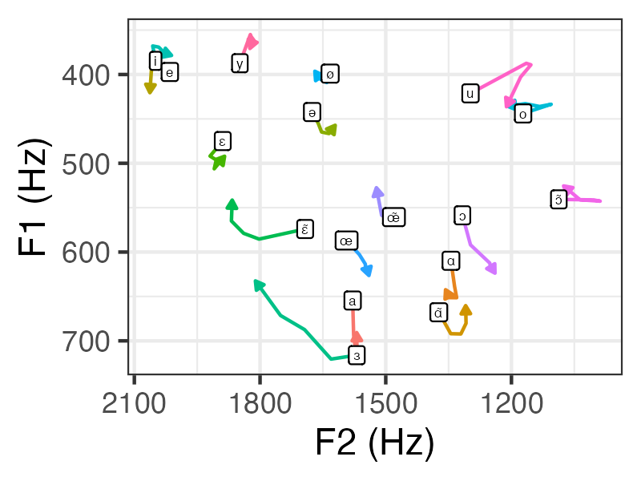

.. _case_study_vowel_dynamics:

****************************
Case study 2: Vowel dynamics
****************************

**Author** : `Massimo Lipari <https://massimolipari.github.io/>`_


Motivation
==========

It has long been known that even vowels traditionally described as monopthongs show gradual changes in formant frequencies over the course of the segment, which appear to be play a significant role in phoneme identification :cite:p:`nearey86modeling,hillenbrand95acoustic`. This phenomenon, referred to as *vowel-inherent spectral change*, motivates analyzing whole formant *tracks*, rather than reducing observations to point measures (e.g., formant frequencies at vowel midpoint).

Vowel-inherent spectral change is by now well-documented in English, but comparatively less so in other languages. Here, we'll be investigating formant dynamics across the vowel system of Quebec French.

This case study demonstrates **workflows for formant measurement in PolyglotDB**:
	- Default
	- Using prototypes
	- Incorporating an external tool for manual measurement


Step 0: Preliminaries
=====================

For this case study, the data come from a corpus of parliamentary speech, the *ParlBleu* corpus :cite:p:`lipari24donnees`. We'll be using a subset of 6 speakers (3 female, 3 male), which can be downloaded `here <https://github.com/massimolipari/ParlBleu-subset>`__. The full corpus is `also available on GitHub by request <https://github.com/massimolipari/Corpus_ParlBleu>`__.

To begin, we'll assume a file structure that looks like the following:

.. code-block:: text

	pgdb_case-studies (your working directory)
	├── ParlBleu-subset (the corpus data)
	│   ├── enrichment_data
	│	│	├──	prototypes.csv (discussed later)
	│   │   └── speaker_metadata.csv (a file containing speaker metadata)
	│   ├── * (one folder for each speaker's data)
	├── vowels
	│   ├── output
	│	│	└── * (starts out empty, output files will be generated here)
	│   ├── * (scripts go here)


Step 1: Importing
=================

We first import the corpus into a PolyglotDB database, much like in Tutorial 1.

.. literalinclude:: ../../examples/case_studies/vowel_dynamics/1_import.py
	:language: python

.. note::
	All the Python scripts in this case study us the so-called ``if __name__ == '__main__':`` idiom, where the code is wrapped in a function called ``main()`` that is executed only when the script is called directly. This is to avoid issues with the ``multiprocessing`` module.


Step 2: Enrichment
==================

We now enrich the corpus with the information required for our case study.

1. We specify the set of phones which represent vowels in the corpus in the ``vowel_set`` variable. We then automatically syllabify all words, in this case assuming that vowels and only vowels are syllabic in this language.

2. We then specify the set of *word* labels used to represent silences in the corpus with the ``pause_labels`` variable. This allows us to split sound files into 'utternaces'--periods of speech surrounded by periods of silence of a predetermined minimum length (150 ms by default, but this can be changed by modifying the ``min_pause_length`` parameter to the ``encode_utterances()`` function).

3. Finally, we want to add basic biographical information about the speakers (e.g., gender, year of birth), which we have stored in the ``speaker_metadata.csv`` file. The values in the first column of this file must match the PolyglotDB speaker ID (the name of the folder containing that speaker's data); every other column is used to create new properties of speakers in the database (with the column name used as the property name).

.. literalinclude:: ../../examples/case_studies/vowel_dynamics/2_enrich.py
	:language: python


Step 3: Formant analysis
========================

We are now ready to measure F1-F3 tracks for vowels in the corpus. There are two ways to do this entirely within PolyglotDB, which we demonstrate below. We'll also show how one might go about using external software to obtain acoustic measures before loading this information back into a PolyglotDB database.

Option A: Quick and dirty
-------------------------

The easiest way to get formant tracks is to use the ``analyze_formant_tracks()`` function in PolyglotDB. This will ultimately call *Praat* in the background, looking for 5 formants with a ceiling frequency of 5500 Hz. These parameters are not guaranteed to produce sensible results for speaker-vowel pairs: accordingly, this method is *not* recommended, but included for completeness in case it's sufficient for your purposes.

By default, ``analyze_formant_tracks()`` will generate acoustic tracks over entire utterances (which requires utterance encoding to have previously been performed). If we instead want formant tracks only over vowel intervals, we can use the ``vowel_label`` argument to specify the subset of phones for which formant tracks are desired. We simply enter the name of some previously encoded phone subset: in this case, the ``'vowel'`` subset encoded in step 2.

.. literalinclude:: ../../examples/case_studies/vowel_dynamics/3a_measure-formants.py
	:language: python


Option B: "Refined" measures
----------------------------

Alternatively, PolyglotDB implements the formant 'refinement' algorithm described in :cite:t:`mielke2019age` through the ``analyze_formant_point_refinement()`` function. In short, this approach generates multiple canadidate analyses for each vowel token by varying the number of formants (while keeping the formant frequency ceiling fixed at 5500 Hz), and automatically selecting the candidate which minimizes the `Mahalanobis distance <https://en.wikipedia.org/wiki/Mahalanobis_distance>`__ between the observation and the multidimensional distribution of the corresponding vowel phoneme in acoustic space, which is referred to as a 'prototype'. For the implementation here, prototypes consist of means and a covariance matrix on 6 acoustic dimensions (the frequencies and bandwidths of the first three formants taken at 33% of duration) for each of the vowel phones being analyzed. The algorithm can be run with multiple iterations: new prototypes are computed for each speaker-phoneme pair at the end of each iteration and used for the following one.

To get formants tracks (rather than points), we add the ``output_tracks = True`` parameter. (This is admittedly a little confusing, given the name of the function.)

i. Getting vowel prototypes
```````````````````````````

By default, ``analyze_formant_points_refinement()`` automatically generates prototypes for the first iteration of the algorithm from first-pass acoustic measures (using the default paramters--5 formants and a formant ceiling of 5500 Hz). Since prototypes are only as good as the acoustic measures from which they are generated, this approach may not always be reliable. In our experience, however, even mediocre prototypes have produced better results than not doing any sort of 'refinement' (for example, using option A above instead), but your mileage may vary.

It's possible to instead specify prototypes for each phone from a CSV file (for any phones lacking prototypes, the default method will be used instead). Ideally, these will have been generated from a decently-large set of robustly hand-checked formant measures obtained from data that are as representative as possible of the new data for which acoustic measures are being obtained. Here, we'll use prototypes generated from hand measurements of 100 randomly sampled tokens of each of the 17 vowel phones from the *ParlBleu* corpus: these can be found in the ``prototypes.csv`` file. (If you use these in your own research, please cite :cite:alp:`lipari24donnees`.) The general method (but not the exact implementation details) used to generate these prototypes is shown below. (When re-running the scripts for yourself, you may skip to step ii.)

*Making prototypes from scratch*

A good way to obtain prototypes for a corpus is to hand-measure a random subset of vowels from the corpus at hand. For this, we'll use the excellent *Praat* plugin
`Fast Track <https://github.com/santiagobarreda/FastTrack/>`_ :cite:p:`barreda21fast`. Like PolyglotDB, *Fast Track* obtains multiple candidate analyses for every token and attempts to automatically select the best one, albeit in a slightly different way: the number of formants is fixed at 5.5, and the formant ceiling is manipulated within a user-defined range. The optimal candidate is determined based on the smoothness of the formant tracks (and optionally, also using some simple heuristics)--the idea being that excessive jitter is typically a sign of a formant tracking error (since articulators can only move relatively slowly and gradually). While convenient, this method is still suceceptible to errors (since it's possible to have a candidate which hallucinates or skips a formant while having smooth tracks), and should not be trusted blindly. The beauty of *Fast Track* is that it allows the user to easily compare the different candidates visually against the spectrogram and override the automatic selection procedure as needed.

Before we can run *Fast Track*, we need to obtain the random sample of vowels we want to manually analyze. First, we run a simple PolyglotDB query for all vowel tokens of interest in the corpus. Here, we'll require the vowels be at least 50 ms long in order to avoid any overly-reduced tokens.

.. literalinclude:: ../../examples/case_studies/vowel_dynamics/3bo1_query.py
	:language: python


We then use an R script to take a random subset of this data. From there, the script will create a new directory (called ``fasttrack`` here), where it'll put a copy of the data in the correct format for use with *Fast Track* `(see here for an explanation) <https://github.com/santiagobarreda/FastTrack/wiki/Preparing-sounds>`__. A copy of each vowel token is extracted from its original sound file with 25 ms of padding on either end and saved as its own sound file in a ``sounds`` directory.

In order to limit the number of spurious candidates considered (and therefore maximize the efficiency and efficacy of the automatic winner selection algorithm), it's helpful to keep the specified formant ceiling range relatively narrow. However, a relatively wide interval is often needed to accomodate the range of interspeaker variation. We can get around this tension by splitting our speakers into groups based on approximate vocal tract length and using different ranges for each group. Here, we'll try and achieve this result by grouping speakers by gender. The script will automatically create separate ``female`` and ``male`` folders, and create a ``sounds`` folder within each where the appropriate sound snippets will be copied.

The script will thus produce the following folder structure:

.. code-block:: text

	fasttrack
	├── female
	│   ├── sounds
	│	│	└── * (extracted sound files will appear)
	├── male
	│   ├── sounds
	│	│	└── * (extracted sound files will appear)


(We could instead analyze each speaker seperately by setting ``split_sounds_by = 'id'`` in the script.)


.. literalinclude:: ../../examples/case_studies/vowel_dynamics/3bo2_sample-vowels.R
	:language: R


We can now run the *Fast Track* analysis: `see Santiago Barreda's tutorials for instructions <https://github.com/santiagobarreda/FastTrack/wiki>`__. We'll obtain 20 candidates using the formant ceiling range of 4000--6000 Hz for male speakers and 4500--6500 Hz for female speakers, and output 3 formants. Once this finishes, feel free to edit the ``winners.csv`` files to select alternate analyses, or to edit formant tracks directly, as desired. (Note that this is not done for this example.)

We now run another R script to collect the final acoustic tracks for all tokens into a single CSV file.

.. literalinclude:: ../../examples/case_studies/vowel_dynamics/3bo3_collect-acoustics.R
	:language: R


Finally, one last R script (adapted from `code on this GitHub repository <https://github.com/MontrealCorpusTools/SPADE/blob/main/make_formant_prototypes.r>`__) is used to interpolate the tracks to the 33% point before obtaining the means and covariance matrix for each phoneme: this gives us our prototypes file.

.. literalinclude:: ../../examples/case_studies/vowel_dynamics/3bo4_make-vowel-prototypes.R
	:language: R


ii. Measuring formants
``````````````````````

We now call the ``analyze_formant_points_refinement()`` function in PolyglotDB, specifying a few additional parameters:

a. ``output_tracks = True`` (default: ``false``), to extract formant tracks with measures every 10 ms (rather than point measures at 33% of duration),
b. ``vowel_label = 'vowel'`` (default: ``vowel``), to specify the subset of phone for which formant measures are desired for (the subset must already have been encoded as a property of phones in the corpus, as in step 2),
c. ``duration_threshold = 0.05`` (default: ``0``), to skip vowels shorter than 50 ms in duration (we would have excluded these from the analysis later anyway, as they are likely too reduced),
d. ``num_iterations = 20`` (default: ``1``), to set the maximum number of iterations of the algorithm for each speaker-vowel pair (if there is no change in output from one iteration to the next, the algorithm is considered to have 'converged' and will end early),
e. ``vowel_prototypes_path = vowel_prototypes_path`` (default: ``''``), to set the path to the prototypes CSV file,

This function first determines the optimal parameters for each phone using point measures taken at the 1/3 point. It then uses these parameters to calculate formant tracks, taking measures every 10 ms.

.. note::
	:cite:t:`mielke2019age` describe a second version of the formant refinement algorithm which considers additional candidate analyses for each phone: new candidates are created from the aforementioned ones by 'dropping' one of the formants, in an attempt to remove any false formants which may have been accidentally tracked. This version of the algortihm can be enabled by passing the ``drop_formant = True`` argument to ``analyze_formant_points_refinement``. It appears to largely depend on the data which version of the algortihm performs better--or indeed, whether there's an appreciable difference in performance at all. We encourage users to experiment with both methods.


.. literalinclude:: ../../examples/case_studies/vowel_dynamics/3b_measure-formants-refined.py
	:language: python


Option C: Using external software
---------------------------------

For many reasons, you may prefer to perform the formant analysis outside of PolyglotDB. For example, you may have a relatively small dataset, where ensuring that all formant tracks are accurate is important and hand-checking all measures is feasible.

The details of how to make this work will likely differ slightly depending on the software you intend to use. If using *Fast Track*, the first three scripts shown above in step i of Option B can be adapted with minimal modifications: only the corpus restructuring script needs to be modified to remove the sampling logic. You may then skip directly to step 5.


Step 4: Querying
================

We now run a simple query to get all vowel tokens in word-final syllables (the accented position in French) that are at least 50 ms long. There are 7474 tokens in the corpus matching these criteria.

By default, the query will output every measurement from the beginning to the end of the vowel: accordingly, the number of measurements will vary from one track to another. It is often more convenient for analyses to interpolate formant tracks to a consistent number of points: PolyglotDB provides built-in functionality for this, which we take advantage of here (interpolating to 9 points).

.. literalinclude:: ../../examples/case_studies/vowel_dynamics/4_query.py
	:language: python


Step 5: Analysis
================

Finally, we use an R script to plot the average position of all phones in F1 × F2 space. We exmaine only the middle portion of the vowel here (the endpoints are not always theoretically interesting, as they can be disporprotionately affected by coarticulation with surrounding vowels). We draw the vowel label at the 25% timepoint: this is also the beginning of an arrow whose head points to the 75% timepoint.

.. literalinclude:: ../../examples/case_studies/vowel_dynamics/5_analysis.R
	:language: r

This gives the following plot:



This vowel space looks fairly reasonable (cf. :cite:alp:`mackenzie10quantittative,coutlee24data`). This is despite only 6 speakers being represented, very few controls for nuisance variables having been included, and no speaker normalization having been performed!
