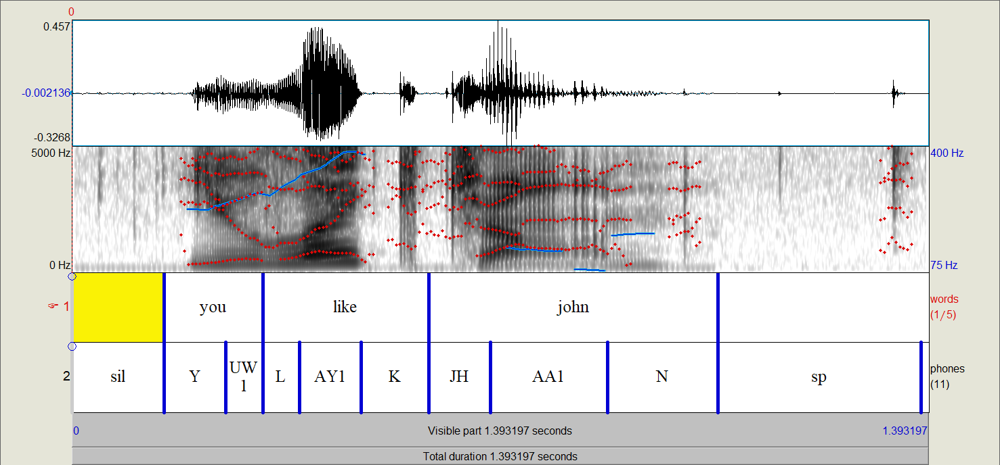
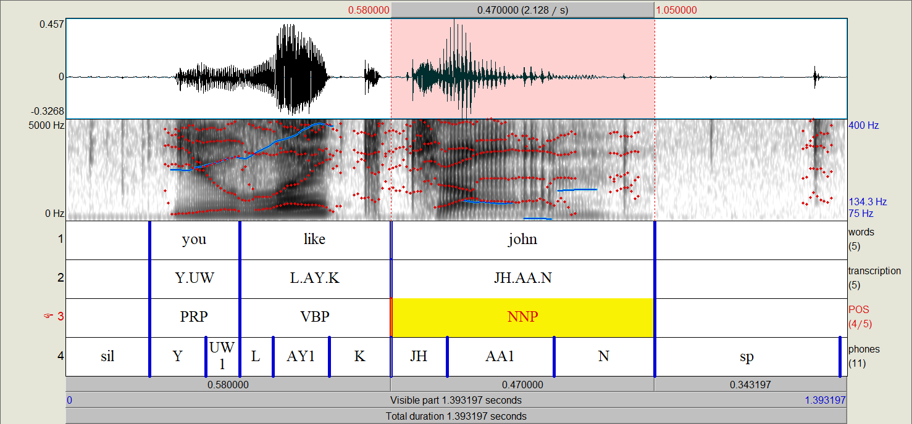

.. _Montreal Forced Aligner: https://github.com/MontrealCorpusTools/Montreal-Forced-Aligner

.. _FAVE-align: https://github.com/JoFrhwld/FAVE

.. _Web-MAUS: https://clarin.phonetik.uni-muenchen.de/BASWebServices/interface/WebMAUSGeneral

.. _LaBB-CAT: http://labbcat.sourceforge.net/

.. _TIMIT: https://catalog.ldc.upenn.edu/LDC93S1

.. _Buckeye: https://buckeyecorpus.osu.edu/

.. _BAS Partitur: http://www.bas.uni-muenchen.de/forschung/publikationen/Granada-98-Partitur.pdf

.. _pgdb_io:

**************
PolyglotDB I/O
**************

In addition to documenting the IO module of PolyglotDB, this document
should serve as a guide for implementing future importers for additional
formats.

Import pipeline
===============

Importing a corpus consists of several steps.  First, a file must be
inspected with the relevant inspect function (i.e., ``inspect_textgrid`` or
``inspect_buckeye``).  These functions generate Parsers for a given format
that allow annotations across many tiers to be coalesced into linguistic
types (word, segments, etc).

As an example, suppose a TextGrid has an interval tier for word labels,
an interval tier for phone labels, tiers for annotating stop information
(closure duration, bursts, VOT, etc).  In this case, our parser would want
to associate the stop information annotations with the phones (or rather a
subset of the phones), and not have them as a separate linguistic type.

Following inspection, the file can be imported easily using a CorpusContext's
``load`` function.  Under the hood, what happens is the Parser object creates
standardized linguistic annotations from the annotations in the text file,
which are then imported into the database.

Currently the following formats are supported:

- Praat TextGrids (:ref:`inspect_textgrids`)
- TextGrid output from forced aligners (`Montreal Forced Aligner`_, `FAVE-align`_, and `Web-MAUS`_)
- Output from other corpus management software (`LaBB-CAT`_)
- `BAS Partitur`_ format
- Corpus-specific formats

  - `Buckeye`_
  - `TIMIT`_

Inspect
-------

Inspect functions (i.e., :code:`inspect_textgrid`) return a guess for
how to parse the annotations present in a given file (or files in a given
directory).  They return a parser of the respective type (i.e., :code:`TextgridParser`)
with an attribute for the :code:`annotation_tiers` detected.  For instance, the inspect function for TextGrids
will return a parser with annotation types for each interval and point tier in the TextGrid.


.. _inspect_textgrids:

Inspect TextGrids
`````````````````

.. note::

   See :ref:`io_tg_parser_api` for full API of the TextGrid Parser


Consider the following TextGrid with interval tiers for words and phones:



Running the :code:`inspect_textgrid` function for this file will return two annotation types. From bottom to top, it will
generate a :code:`phone` annotation type and a :code:`word` annotation type.  Words and phones are two special linguistic
types in PolyglotDB.  Other linguistic types can be defined in a TextGrid (i.e., grouping words into utterances or phones into syllables,
though functionality exists for computing both of those automatically), but word and phone tiers must be defined.

.. note::

   Which tier corresponds to which special :code:`word` and :code:`phone` type is done via heuristics.  The first and most
   reliable is whether the tier name contains "word" or "phone" in their tier name.  The second is done by using cutoffs
   for mean and SD of word and phone durations in the Buckeye corpus to determine if the intervals are more likely to be
   word or phones.  For reference, the mean and SD of words used is 0.2465409 and 0.03175723, and those used for phones
   is 0.08327773 and 0.03175723.

From the above TextGrid, phones will have a :code:`label` property (i.e., "Y"), a :code:`begin` property (i.e., 0.15),
and a :code:`end` property (i.e., 0.25).
Words will have a :code:`label` property (i.e., "you"), a :code:`begin` property (i.e., 0.15),
and a :code:`end` property (i.e., 0.25), as well as a computed :code:`transcription`
property
made of up of all of the included phones based on timings (i.e., "Y.UW1").  Any empty intervals will result in "words"
that have the :code:`label` of "<SIL>", which can then be marked as pause later in corpus processing
(see :ref:`encoding_pauses` for more details).

.. note::

   The computation of transcription uses the midpoints of phones and whether they are between the begin and end time
   points of words.


Inspect forced aligned TextGrids
````````````````````````````````

Both the Montreal Forced Aligner and FAVE-aligner generate TextGrids for files in two formats that PolyglotDB can parse.  The first format
is for files with a single speaker.  These files will have two tiers, one for words (named :code:`words` or :code:`word`)
and one for phones (named :code:`phones` or :code:`phone`).
The second format is for files with multiple speakers, where each speaker will have a pair of tiers for words (formatted as :code:`Speaker name - words`)
and phones (formatted as :code:`Speaker name - phones`).

TextGrids generated from `Web-MAUS`_ have a single format with a tier for words (named :code:`ORT`), a tier for the canonical
transcription (named :code:`KAN`) and a tier for phones (named :code:`MAU`).  In parsing, just the tiers for words and
phones are used, as the transcription will be generated automatically.

.. note::

   See :ref:`io_mfa_parser_api` for full API of the MFA Parser, :ref:`io_fave_parser_api` for full API of the FAVE Parser,
   and :ref:`io_maus_parser_api` for the full API of the MAUS Parser.


Inspect LaBB-CAT formatted TextGrids
````````````````````````````````````

The LaBB-CAT system generates force-aligned TextGrids for files in a format that PolyglotDB can parse (though some editing may be
required due to issues in exporting single speakers in LaBB-CAT).  As with the other supported aligner output formats,
PolyglotDB looks for word and phone tiers per speaker (or for just a single speaker depending on export options).  The
parser will use :code:`transcript` to find the word tiers (i.e. :code:`Speaker name - transcript`) and :code:`segment` to find
the phone tiers (i.e., :code:`Speaker name - phones`).

.. note::

   See :ref:`io_labbcat_parser_api` for full API of the LaBB-CAT Parser

Inspect Buckeye Corpus
``````````````````````

The `Buckeye`_ Corpus is stored in an idiosyncratic format that has two text files per sound file (i.e., :code:`s0101a.wav`), one detailing information
about words (i.e., :code:`s0101a.words`) and one detailing information about surface phones (i.e. :code:`s0101a.phones`).  The PolyglotDB
parser extracts label, begin and end for each phone.  Words have type properties for their underlying transcription and
token properties for their part of speech and begin/end.

.. note::

   See :ref:`io_buckeye_parser_api` for full API of the Buckeye Parser

Inspect TIMIT Corpus
````````````````````

The `TIMIT`_ corpus is stored in an idiosyncratic format that has two text files per sound file (i.e., :code:`sa1.wav`), one detailing information
about words (i.e., :code:`sa1.WRD`) and one detailing information about surface phones (i.e. :code:`sa1.PHN`).  The PolyglotDB
parser extracts label, begin and end for each phone and each word.  Time stamps are converted from samples in the original text files
to seconds for use in PolyglotDB.

.. note::

   See :ref:`io_timit_parser_api` for full API of the Buckeye Parser

.. _modifying_parsers:

Modifying aspects of parsing
----------------------------

Additional properties for linguistic units can be imported as well through the use of extra interval tiers when using a
TextGrid parser (see :ref:`inspect_textgrids`), as in the following TextGrid:



Here we have properties for each word's part of speech (POS tier) and transcription.  The transcription tier will overwrite
the automatic calculation of transcription based on contained segments.  Each of these will be properties will be type properties
by default (see :ref:`neo4j_implementation` for more details).  If these properties are meant to be token level properties (i.e.,
the part of speech of a word varies depending on the token produced), it can changed as follows:

.. code-block:: python

    from polyglotdb import CorpusContext
    import polyglotdb.io as pgio

    parser = pgio.inspect_textgrid('/path/to/textgrid/file/or/directory')
    parser.annotation_tiers[2].type_property = False # The index of the TextGrid tier for POS is 2

    # ... code that uses the parser to import data

If the content of a tier should be ignored (i.e., if it contains information not related to any annotations in particular),
then it can be manually marked to be ignored as follows:

.. code-block:: python

    from polyglotdb import CorpusContext
    import polyglotdb.io as pgio

    parser = pgio.inspect_textgrid('/path/to/textgrid/file/or/directory')
    parser.annotation_tiers[0].ignored = True # Index of 0 if the first tier should be ignored

    # ... code that uses the parser to import data

Parsers created through other inspect functions (i.e. Buckeye) can be modified in similar ways, though the TextGrid parser
is necessarily the most flexible.

Speaker parsers
```````````````

There are two currently implemented schemes for parsing speaker names from a file path.  The first is the :ref:`filename_speaker_parser`,
which takes a number of characters in the base file name (without the extension) starting either from the left or right. For
instance, the path :code:`/path/to/buckeye/s0101a.words` for a Buckeye file would return the speaker :code:`s01` using 3 characters from the left.

The other speaker parser is the :ref:`directory_speaker_parser`, which parses speakers from the directory that contains
the specified path.  For instance, given the path :code:`/path/to/buckeye/s01/s0101a.words` would return :code:`s01` because the containing
folder of the file is named :code:`s01`.

Load discourse
--------------

Loading of discourses is done via a CorpusContext's ``load`` function:

.. code-block:: python

   import polyglotdb.io as pgio

   parser = pgio.inspect_textgrid('/path/to/textgrid.TextGrid')

   with CorpusContext(config) as c:
       c.load(parser, '/path/to/textgrid.TextGrid')

Alternatively, ``load_discourse`` can be used with the same arguments.
The ``load`` function automatically determines whether the input path to
be loaded is a single file or a folder, and proceeds accordingly.

Load directory
--------------

As stated above, a CorpusContext's ``load`` function will import a directory of
files as well as a single file, but the ``load_directory`` can be explicitly
called as well:

.. code-block:: python

   import polyglotdb.io as pgio

   parser = pgio.inspect_textgrid('/path/to/textgrids')

   with CorpusContext(config) as c:
       c.load_directory(parser, '/path/to/textgrids')

Writing new parsers
-------------------

New parsers can be created through extending either the :ref:`io_base_parser_api` class or one of the more specialized
parser classes. There are in general three aspects that need to be implemented.  First, the :code:`_extensions` property should
be updated to reflect the file extensions that the parser will find and attempt to parse.  This property should be an iterable,
even if only one extension is to be used.

Second, the :code:`__init__` function should be implemented if anything above and beyond the based class init function is required
(i.e., special speaker parsing).

Finally, the :code:`parse_discourse` function should be overwritten to implement some way of populating data on the annotation tiers
from the source data files and ultimately create a :code:`DiscourseData` object (intermediate data representation for straight-forward importing
into the Polyglot databases).

Creating new parsers for forced aligned TextGrids requires simply extending the :class:`polyglotdb.io.parsers.aligner.AlignerParser`
and overwriting the :code:`word_label` and :code:`phone_label` class properties.  The :code:`name` property should also be
set to something descriptive, and the :code:`speaker_first` should be set to False if speakers follow word/phone labels in
the TextGrid tiers (i.e., :code:`words -Speaker name` rather than :code:`Speaker name - words`). See :class:`polyglotdb.io.parsers.mfa.MfaParser`,
:class:`polyglotdb.io.parsers.fave.FaveParser`, :class:`polyglotdb.io.parsers.maus.MausParser`, and
:class:`polyglotdb.io.parsers.labbcat.LabbcatParser` for examples.

Exporters
=========

Under development.
