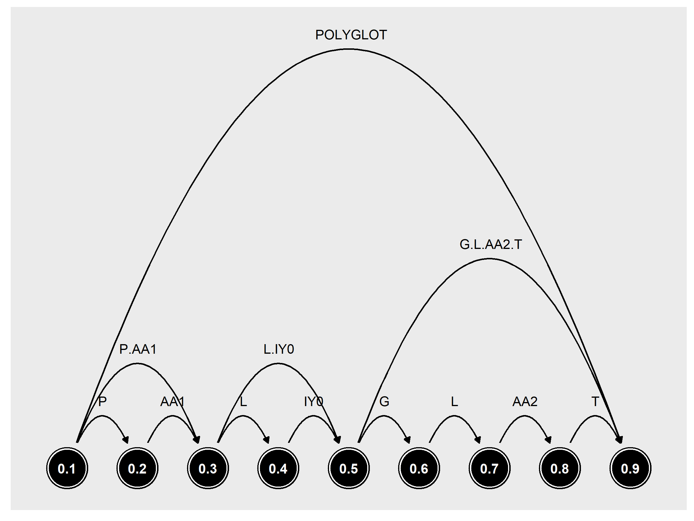
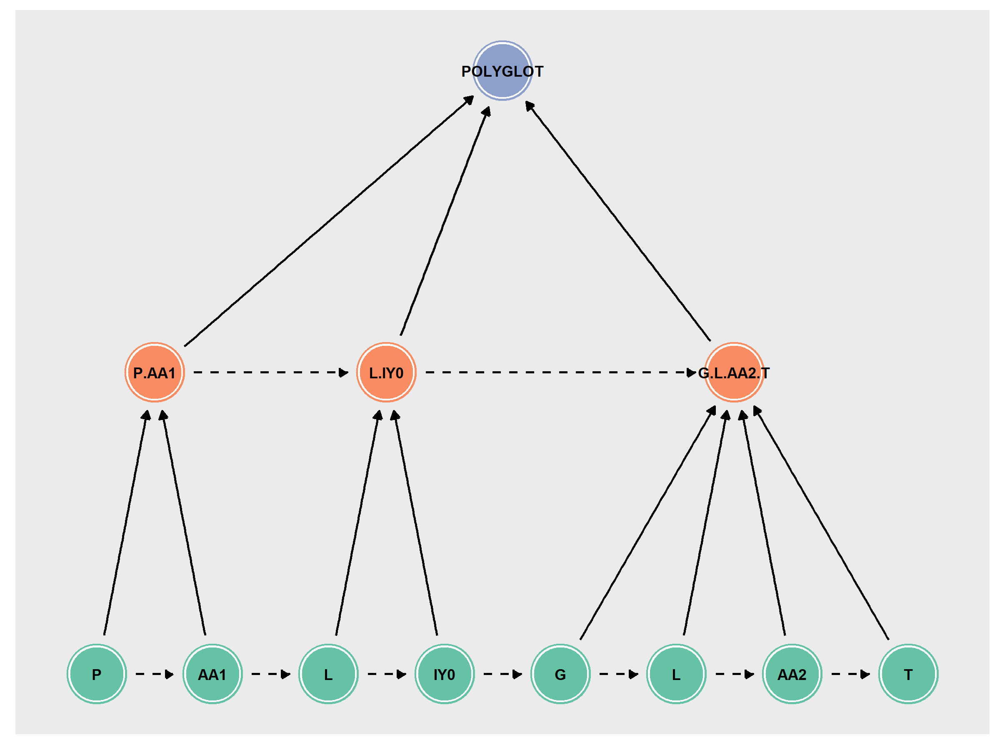
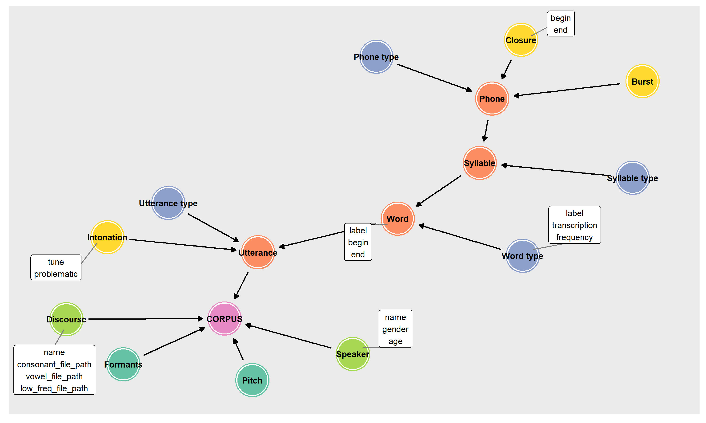

.. _EMU-SDMS: https://ips-lmu.github.io/EMU.html

.. _LaBB-CAT: http://labbcat.sourceforge.net/

.. _Bird & Liberman (1999): http://www.aclweb.org/anthology/W99-0301

.. _Cypher documentation: https://neo4j.com/developer/cypher-query-language/

.. _neo4j_implementation:

********************
Neo4j implementation
********************

This section details how PolyglotDB saves and structures data within Neo4j.

.. note::

   This section assumes some familiarity with Cypher and Neo4j, see the `Cypher documentation`_ for more details and
   reference.

Annotation Graphs
=================

The basic formalism in PolyglotDB for modelling and storing transcripts is that of annotation graphs, originally proposed
by `Bird & Liberman (1999)`_.  In this formalism, transcripts are directed acyclic graphs.  Nodes in the graph represent
time points in the audio file and edges between the nodes represent annotations (such as phones, words, utterances, etc). This
style of graph is illustrated below.




The annotation graph formalism has been implemented in other speech corpus management systems, in either SQL
(`LaBB-CAT`_) or custom file-based storage systems (`EMU-SDMS`_).  One of the principle goals in developing PolyglotDB
was to be scalable to large datasets (potentially hundreds of hours) and still have good performance in querying the database.
Initial implementations in SQL were not as fast as I would have liked, so Neo4j was selected as the storage backend.
Neo4j is a NoSQL graph database where nodes and edges are fundamental elements in both the storage and Cypher query language.
Given its active development and use in enterprise systems, it is the best choice for meeting the scalability and performance
considerations.

However, Neo4j prioritizes nodes far more than edges.  In general, their use case is primarily something like IMDB, for instance.
In such a case, you'll have nodes for movies, shows, actors, directors, crew, etc, each with different labels associated with them.
Edges represent relationships like "acted in", or "directed".  The nodes have the majority of the properties, like names, dates of birth,
gender, etc, and relationships are sparse/empty.  The annotation graph formalism has nodes being relatively sparse (just time point),
and the edges containing the properties (label, token properties, speaker information, etc). Neo4j uses indices to speed up queries,
but these are focused on node properties rather than edge properties (or were at the beginning of development).  As such,
the storage model was modified from the annotation graph formalism into something more node-based, seen below.




Rather than time points as nodes, the actual annotations are nodes, and relationships between them are either hierarchical
(i.e., the phone :code:`P` is contained by the syllable :code:`P.AA1`, represented by solid lines in the figure above)
or precedence (the phone :code:`P` precedes the phone :code:`AA1`, represented by dashed lines in the figure above).
Each node has properties for begin and end time points, as well as any arbitrary encoded information
(i.e., part of speech tags).  Each node of a given annotation type (word, syllable, phone) is labelled as such in Neo4j,
speeding up queries.

A full list of node types in a fresh PolyglotDB Neo4j database is as follows:

.. code-block:: text

    :phone
    :phone_type
    :word
    :word_type
    :Speaker
    :Discourse
    :speech

.. note::

    A special tag for the corpus name is added to every node in the corpus, in case multiple corpora are imported in the
    same database

The following node types can further be added to via enrichment:

.. code-block:: text

    :pause
    :utterance
    :utterance_type (never really used)
    :syllable
    :syllable_type

The following is a list of all the relationship types in the Neo4j database:

.. code-block:: text

    :is_a (relation between type and token nodes)
    :precedes (precedence relation)
    :precedes_pause (precedence relation for pauses when encoded)
    :contained_by (hierarchical relation)
    :spoken_by (relation between tokens and speakers)
    :spoken_in (relation between tokens and discourses)
    :speaks_in (relation between speakers and discourses)
    :annotates (relation between annotations and subannotations)

.. _dev_hierarchy:

Corpus hierarchy representation
===============================

Metadata about the corpus is stored in a graph hierarchy, which corresponds to a :class:`polyglotdb.structure.Hierarchy` object belonging to
:class:`polyglotdb.corpus.CorpusContext`
objects.  In the Neo4j graph, there is a :code:`Corpus` root node, with all encoded annotations linked as they would be
in an annotation graph for a given discourse (i.e., Utterance -> Word -> Syllable -> Phone in orange below).  These nodes contain
a list of properties that will be found on each node in the annotation graphs (i.e., :code:`label`, :code:`begin`, :code:`end`),
along with what type of data each property is (i.e., string, numeric, boolean, etc).  There will also be a property for :code:`subsets` that
is a list of all the token subsets of that annotation type.
Each of these
annotations are linked to type nodes (in blue below) that has a list of properties that belong to the type (i.e., in the figure below, word types
have :code:`label`, :code:`transcription` and :code:`frequency`).



In addition, if subannotations are encoded, they will be represented in the hierarchy graph as well (i.e., :code:`Burst`,
:code:`Closure`, and :code:`Intonation` in yellow above), along with all the properties they contain.  :code:`Speaker`
and :code:`Discourse` properties are encoded in the graph hierarchy object as well as any acoustics that have been encoded
and are stored in the InfluxDB portion of the database.

.. _dev_query:

Query implementation
====================

Queries are constructed as Python objects (descended from :class:`polyglotdb.query.base.query.BaseQuery`) and are generated
from methods on a CorpusContext object, as below.

+-------------+-----------------------------------------------------------+-----------------------------------------------------------+
| Data type   | CorpusContext method                                      | Query class                                               |
+=============+===========================================================+===========================================================+
| Annotations | :meth:`polyglotdb.corpus.CorpusContext.query_graph`       | :class:`polyglotdb.query.annotations.query.GraphQuery`    |
+-------------+-----------------------------------------------------------+-----------------------------------------------------------+
| Lexicon     | :meth:`polyglotdb.corpus.CorpusContext.query_lexicon`     | :class:`polyglotdb.query.lexicon.query.LexiconQuery`      |
+-------------+-----------------------------------------------------------+-----------------------------------------------------------+
| Speaker     | :meth:`polyglotdb.corpus.CorpusContext.query_speakers`    | :class:`polyglotdb.query.speaker.query.SpeakerQuery`      |
+-------------+-----------------------------------------------------------+-----------------------------------------------------------+
| Discourse   | :meth:`polyglotdb.corpus.CorpusContext.query_discourses`  | :class:`polyglotdb.query.discourse.query.DiscourseQuery`  |
+-------------+-----------------------------------------------------------+-----------------------------------------------------------+

The main structure of each of the query submodules is as follows:

The following walk through of the basic components of a query submodule will use a speaker query for illustration purposes.
In this example, we'll be trying to extract the list of male speakers (with the assumption that speakers have been encoded
for gender and that the corpus is appropriately named :code:`corpus`).  In Cypher, this query would be:

.. code-block:: cypher

   MATCH (node_Speaker:Speaker:corpus)
   WHERE node_Speaker.gender = "male"
   RETURN node_Speaker.name AS speaker_name

This query in polyglotdb would be:

.. code-block:: python

   with CorpusContext('corpus') as c:
       q = c.query_speakers() # Generate SpeakerQuery object
       q = q.filter(c.speaker.gender == 'male') # Filter to just the speakers that have `gender` set to "male"
       q = q.columns(c.speaker.name.column_name('speaker_name')) # Return just the speaker name (with the `speaker_name` alias)
       results = q.all()

The :code:`attributes.py` file contains the definitions of classes corresponding to nodes and attributes in the Neo4j database.
These classes have code for how to represent them in cypher queries and how properties are extracted.  As an example of a somewhat simple case,
consider :class:`polyglotdb.query.speaker.attributes.SpeakerNode` and :class:`polyglotdb.query.speaker.attributes.SpeakerAttribute`.
A :code:`SpeakerNode` object will have an alias in the Cypher query of `node_Speaker` and an initial look up definition for
the query as follows:

.. code-block:: cypher

   (node_Speaker:Speaker:corpus)

The :class:`polyglotdb.query.speaker.attributes.SpeakerAttribute` class is used for the :code:`gender` and :code:`name`
attributes referenced in the query.  These are created through calling :code:`c.speaker.gender` (the :code:`__getattr__` method for
both the :code:`CorpusContext` class and the :code:`SpeakerNode` class are overwritten to allow for this kind of access).
Speaker attributes use their node's alias to construct how they are referenced in Cypher, i.e. for :code:`c.speaker.gender`:

.. code-block:: cypher

   node_Speaker.gender

When the :code:`column_name` function is called, an output alias is used when constructing :code:`RETURN` statements in Cypher:

.. code-block:: cypher

   node_Speaker.name AS speaker_name


The crucial part of a query is, of course, the ability to filter.  Filters are constructed using Python operators, such as
:code:`==` or :code:`!=`, or functions replicating other operators like :code:`.in_()`.  Operators on attributes return
classes from the :code:`elements.py` file of a query submodule.  For instance, the :class:`polyglotdb.query.base.elements.EqualClauseElement`
is returned when the :code:`==` is used (as in the above query), and this object handles how to convert the operator into
Cypher, in the above case of :code:`c.speaker.gender == 'male'`, it will generate the following Cypher code when requested:

.. code-block:: cypher

   node_Speaker.gender = "male"

The :code:`query.py` file contains the definition of the Query class descended from :class:`polyglotdb.query.base.query.BaseQuery`.
The :code:`filter` and :code:`columns` methods allow ClauseElements and Attributes to be added for the construction of the
Cypher query.  When :code:`all` is called (or :code:`cypher` which does the actual creation of the Cypher string), the first step
is to inspect the elements and attributes to see what nodes are necessary for the query.  The definitions of each of these nodes are then
concatenated into a list for the :code:`MATCH` part of the Cypher query, giving the following for our example:

.. code-block:: cypher

   MATCH (node_Speaker:Speaker:corpus)


Next the filtering elements are constructed into a :code:`WHERE` clause (separated by :code:`AND` for more than one element),
giving the following for our example:

.. code-block:: cypher

   WHERE node_Speaker.gender = "male"

And finally the :code:`RETURN` statement is constructed from the list of columns specified (along with their specified column names):


.. code-block:: cypher

   RETURN node_Speaker.name AS speaker_name


If columns are not specified in the query, then a Python object containing all the information of the node is returned, according
to classes in the :code:`models.py` file of the submodule.  For our speaker query, if the columns are omitted, then the returned
results will have all speaker properties encoded in the corpus.  In terms of implementation, the following query in polyglotdb

.. code-block:: python

   with CorpusContext('corpus') as c:
       q = c.query_speakers() # Generate SpeakerQuery object
       q = q.filter(c.speaker.gender == 'male') # Filter to just the speakers that have `gender` set to "male"
       results = q.all()
       print(results[0].name) # Get the name of the first result

will generate the following Cypher query:

.. code-block:: cypher

   MATCH (node_Speaker:Speaker:corpus)
   WHERE node_Speaker.gender = "male"
   RETURN node_Speaker


.. _dev_annotation_query:

Annotation queries
------------------

Annotation queries are the most complicated kind due to all of the relationships linking nodes.  Where Speaker, Discourse and
Lexicon queries are really just lists of nodes with little linkages between nodes, Annotation queries leverage the relationships
in the annotation graph quite a bit.

Basic query
```````````

Given a relatively basic query like the following:

.. code-block:: python

    with CorpusContext('corpus') as c:
        q = c.query_graph(c.word)
        q = q.filter(c.word.label == 'some_word')
        q = q.columns(c.word.label.column_name('word'), c.word.transcription.column_name('transcription'),
                      c.word.begin.column_name('begin'),
                      c.word.end.column_name('end'), c.word.duration.column_name('duration'))
        results = q.all()


Would give a Cypher query as follows:

.. code-block:: cypher

    MATCH (node_word:word:corpus)-[:is_a]->(node_word_type:word_type:corpus),
    WHERE node_word_type.label = "some_word"
    RETURN node_word_type.label AS word, node_word_type.transcription AS transcription,
           node_word.begin AS begin, node_word.end AS end,
           node_word.end - node_word.begin AS duration

The process of converting the Python code into the Cypher query is similar to the above Speaker example, but each step has
some complications.  To begin with, rather than defining a single node, the annotation node definition contains two nodes, a word token
node and a word type node linked by the :code:`is_a` relationship.

The use of type properties allows for a more efficient look up on the :code:`label` property (for convenience and debugging, word
tokens also have a :code:`label` property).  The Attribute objects will look up what properties are type vs token for constructing
the Cypher statement.

Additionally, :code:`duration` is a special property that is calculated based off of the token's :code:`begin` and :code:`end`
properties at query time.  This way if the time points are updated, the duration remains accurate.  In terms of efficiency,
subtraction at query time is not costly, and it does save on space for storing an additional property.  Duration can still be
used in filtering, i.e.:

.. code-block:: python

    with CorpusContext('corpus') as c:
        q = c.query_graph(c.word)
        q = q.filter(c.word.duration > 0.5)
        q = q.columns(c.word.label.column_name('word'),
                      c.word.begin.column_name('begin'),
                      c.word.end.column_name('end'))
        results = q.all()

which would give the Cypher query:

.. code-block:: cypher

    MATCH (node_word:word:corpus)-[:is_a]->(node_word_type:word_type:corpus),
    WHERE node_word.end - node_word.begin > 0.5
    RETURN node_word_type.label AS word,  node_word.begin AS begin,
           node_word.end AS end,  AS duration

Precedence queries
``````````````````

Aspects of the previous annotation can be queried via precedence queries like the following:

.. code-block:: python

    with CorpusContext('corpus') as c:
        q = c.query_graph(c.phone)
        q = q.filter(c.phone.label == 'AE')
        q = q.filter(c.phone.previous.label == 'K')
        results = q.all()

will result the following Cypher query:


.. code-block:: cypher

    MATCH (node_phone:phone:corpus)-[:is_a]->(node_phone_type:phone_type:corpus),
    (node_phone)<-[:precedes]-(prev_1_node_phone:phone:corpus)-[:is_a]->(prev_1_node_phone_type:phone_type:corpus)
    WHERE node_phone_type.label = "AE"
    AND prev_1_node_phone_type.label = "K"
    RETURN node_phone, node_phone_type, prev_1_node_phone, prev_1_node_phone_type


Hierarchical queries
````````````````````

Hierarchical queries are those that reference some annotation higher or lower than the originally specified annotation.  For
instance to do a search on phones and also include information about the word as follows:

.. code-block:: python

    with CorpusContext('corpus') as c:
        q = c.query_graph(c.phone)
        q = q.filter(c.phone.label == 'AE')
        q = q.filter(c.phone.word.label == 'cat')
        results = q.all()

This will result in Cypher query as follows:

.. code-block:: cypher

    MATCH (node_phone:phone:corpus)-[:is_a]->(node_phone_type:phone_type:corpus),
    (node_phone_word:word:corpus)-[:is_a]->(node_phone_word_type:word_type:corpus),
    (node_phone)-[:contained_by]->(node_phone_word)
    WHERE node_phone_type.label = "AE"
    AND node_phone_word_type.label = "cat"
    RETURN node_phone, node_phone_type, node_phone_word, node_phone_word_type


Spoken queries
``````````````

Queries can include aspects of speaker and discourse as well.  A query like the following:

.. code-block:: python

    with CorpusContext('corpus') as c:
        q = c.query_graph(c.phone)
        q = q.filter(c.phone.speaker.name == 'some_speaker')
        q = q.filter(c.phone.discourse.name == 'some_discourse')
        results = q.all()

Will result in the following Cypher query:

.. code-block:: cypher

    MATCH (node_phone:phone:corpus)-[:is_a]->(node_phone_type:phone_type:corpus),
    (node_phone)-[:spoken_by]->(node_phone_Speaker:Speaker:corpus),
    (node_phone)-[:spoken_in]->(node_phone_Discourse:Discourse:corpus)
    WHERE node_phone_Speaker.name = "some_speaker"
    AND node_phone_Discourse.name = "some_discourse"
    RETURN node_phone, node_phone_type

.. _dev_annotation_query_optimization:

Annotation query optimization
`````````````````````````````

There are several aspects to query optimization that polyglotdb does.  The first is that rather than :class:`polyglotdb.query.annotations.query.GraphQuery`
the default objects returned are actually :class:`polyglotdb.query.annotations.query.SplitQuery` objects.  The behavior of these
objects is to split a query into either Speakers or Discourse and have smaller :code:`GraphQuery` for each speaker/discourse.
The results object that gets returned then iterates over each of the results objects returned by the :code:`GraphQuery`
objects.

In general splitting functionality by speakers/discourses (and sometimes both) is the main way that Cypher queries are performant in polyglotdb.
Aspects such as enriching syllables and utterances are quite complicated and can result in out of memory errors if the splits are
too big (despite the recommended optimizations by Neo4j, such as using :code:`PERIODIC COMMIT` to split the transactions).

.. _dev_lexicon_query:

Lexicon queries
---------------

.. note::

   While the name of this type of query is :code:`lexicon`, it's really just queries over types, regardless of their linguistic
   type. Phone, syllable, and word types are all queried via this interface.  Utterance types are not really used
   for anything other than consistency with the other annotations, as the space of possible utterance is basically infinite,
   but the space of phones, syllables and words are more constrained, and type properties are more useful.

Lexicon queries are more efficient queries of annotation types than the annotation queries above.  Assuming word types have been
enriched with a frequency property, a polyglotdb query like:


.. code-block:: python

   with CorpusContext('corpus') as c:
       q = c.query_lexicon(c.word_lexicon) # Generate LexiconQuery object
       q = q.filter(c.word_lexicon.frequency > 100) # Subset of word types based on their frequency
       results = q.all()

Would result in a Cypher query like:

.. code-block:: cypher

   MATCH (node_word_type:word_type:corpus)
   WHERE node_word_type.frequency > 100
   RETURN node_word_type


.. _dev_spoken_query:

Speaker/discourse queries
-------------------------

Speaker and discourse queries are relatively straightforward with only a few special annotation node types or attribute types.
See :ref:`dev_query` for an example using a SpeakerQuery.

The special speaker attribute is :code:`discourses` which will return a list of the discourses that the speaker spoke in,
and conversely, the :code:`speakers` attribute of DiscourseNode objects will return a list of speakers who spoke in that discourse.

A polyglotdb query like the following:

.. code-block:: python


   with CorpusContext('corpus') as c:
       q = c.query_speakers() # Generate SpeakerQuery object
       q = q.filter(c.speaker.gender == 'male') # Filter to just the speakers that have `gender` set to "male"
       q = q.columns(c.speaker.discourses.name.column_name('discourses')) # Return just the speaker name (with the `speaker_name` alias)
       results = q.all()

will generate the following Cypher query:


.. code-block:: cypher

   MATCH (node_Speaker:Speaker:corpus)
   WHERE node_Speaker.gender = "male"
   WITH node_Speaker
   MATCH (node_Speaker)-[speaks:speaks_in]->(node_Speaker_Discourse:Discourse:corpus)
   WITH node_Speaker, collect(node_Speaker_Discourse) AS node_Speaker_Discourse
   RETURN extract(n in node_Speaker_Discourse|n.name) AS discourses